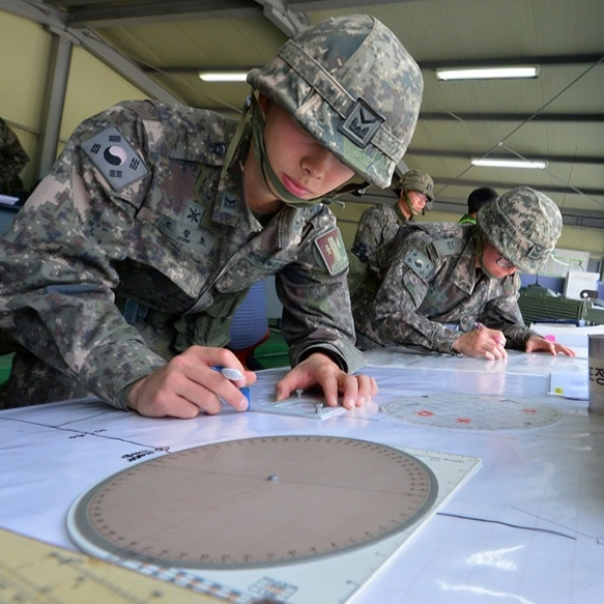

# mortar-fdc-with-casio


카시오 공학용 계산기로 화력지원 제원 계산하기

[REAMDE.md](./README.md)

<p>
    
    
    
</p>

## 요구사항

1. CASIO BASIC와 프로그램 모드(PROG)를 지원하는 카시오 공학용 계산기
   - 예. FX-5800P 

## 목차

### 1. 서론

   #### 1.1. 개발목적
   
   사람이 직접 계산판에 제도하여 수평거리와 편각을 구하는 방법은 값을 엄밀히 알 수 없을 뿐 아니라 FDC가 실수할 가능성이 다분하다. 이를 해결하기 위해 공학용 계산기를 도입, 계산의 오차를 줄임과 동시에 계산 시간을 단축하고자 한다.

### 2. 본론

   #### 2.1. 카시오 공학용 계산기 내장함수

   - ```Imp(a+bi)```, ```Rep(a+bi)```: 복소수의 실수부, 허수부를 추출한다.
   - ```Pol(x, y)```, ```Rec(r, θ)```: 데카르트좌표계-극좌표계 간 변환을 수행한다.
   - ```Locate(x, y, n)```: ```PROG``` 모드에서 지정한 위치에 특정 문자 및 숫자를 띄운다.

   #### 2.2. 카시오 공학용 계산기 내장기능

   - [FILE] 키를 통해 ```COMP``` 모드에서 바로 프로그램을 실행할 수 있다.
   - [MODE]-[5] 를 통해 프로그램 모드로 진입할 수 있다. 해당 모드에서 계산기에 프로그램을 저장, 수정할 수 있다.

   #### 2.3. 계산판을 계산기로 이식

   프로그램이 무엇을 하고 있는지 쉽게 알 수 있도록 교본 상 계산판으로 수행하는 계산 과정을 최대한 계산기로 재현하였다.
   
   기존의 삼각함수를 이용한 계산법은 방안좌표법 이상으로 응용하기 힘들다. 따라서 반지름(r)과 각(θ)으로 현재 위치를 구하는 극좌표계를 사용하였다.

   예컨대 ```종·횡좌표를 계산판에 표시```하는 것은 ```종·횡 데카르트 좌표에 해당하는 r과 θ를 계산```하여 재현하였다.
   
   밀 단위계에서 도 단위계로 변환: $`Degrees = (Mils / 160) × 9`
   
   밀 단위계에서 도 단위계로 변환(역수를 적용한다): $`Mils = (Degrees / 9) × 160`
   
   기준포에서 기준겨냥대를 조준하였을 때 최대한 쉽게 방열할 수 있는 기준겨냥대의 위치를 나침의로 가늠할 수 있도록 후퇴사격방위각을 함께 표시한다.
   
   계산한 결과를 실수로 지워버린 경우 바로 직전에 계산한 결과를 불러올 수 있도록 행렬 기능(MATRIX)을 이용하여 저장, 확인할 수 있도록 하였다. (아직 방안좌표법에만 구현)
   
   최대한 적은 변수 개수를 유지하기 위해 복소수를 사용하여 한 변수에 두 개의 수를 저장한다.

### 3. 결과물
   
   - 계산 프로그램

      - Grid (방안좌표법)

        [MOT.GRID.prizmbasic](./MOT.GRID.prizmbasic)

      - Polar Plot (극표정법)
      
         [MOT.POLAR.prizmbasic](./MOT.POLAR.prizmbasic)
         
      - Shift from a Known Point (기지점전이법)
      
         [MOT.SHIFT.prizmbasic](./MOT.SHIFT.prizmbasic)
         
      - Firing Correction (수정)
      
         [MOT.FIX.prizmbasic](./MOT.FIX.prizmbasic)
         
   - 종속 프로그램
   
      - Read recent 1 calculation (최근1개계산 확인)
      
         [MOT.RECENT.prizmbasic](./MOT.RECENT.prizmbasic)
         
      - Clean Setup (설정초기화)
      
         [ZCLNSETUP.prizmbasic](./ZCLNSETUP.prizmbasic)
         
      - Variable value to 0-6400Mils (변수값을 0-6400밀 이내로)
      
         [ZINANGL.prizmbasic](./ZINANGL.prizmbasic)

## 참고문헌

- TRADOC. (2013). ATP 3-09.30 Techniques for Observed Fire. US Army. [PDF](./references-archive/ARN5011_ATP%203-09x30%20FINAL%20WEB.pdf)
- TRADOC. (2009). GTA 17-02-015 Call For Fire. US Army. [PDF](./references-archive/call_for_fire.pdf)
- TRADOC. (2017). TC 3-22.91 Mortar Fire Direction Procedures. US Army. [PDF](./references-archive/ARN3488_TC%203-22x91%20FINAL%20WEB%201.pdf)
- TRADOC. (2017). DA Form 2399 Computer’s Record (LRA). US Army. [PDF](./references-archive/ARN3823_DA%20FORM%202399%20FINAL.pdf)
- Jay♬. (2013, April 4). 박격포 공학용 계산 식. Tistory. [https://lunaticju.tistory.com/32](https://lunaticju.tistory.com/32).
