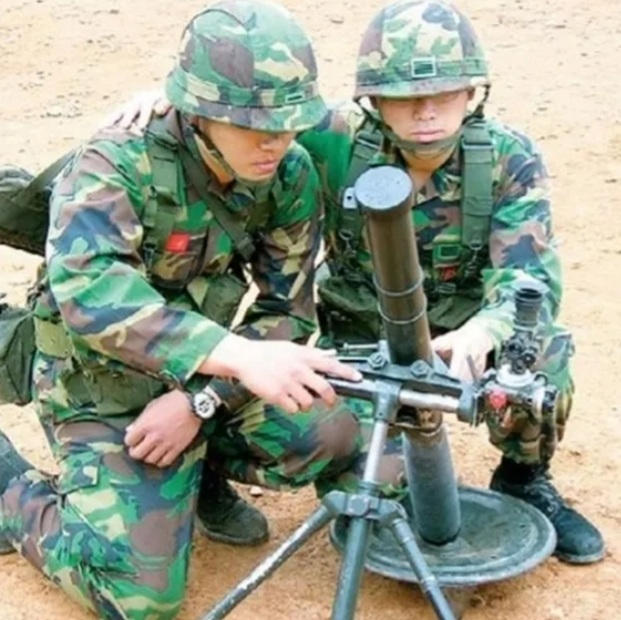

# mortar-fdc-with-casio


Calculate mortar firing chart with Casio scientific calculator

[REAMDE.ko-KR.md](./README.ko-KR.md)

<p>
    
    
    
</p>

## Requirements

1. Casio scientific calculator including Program Mode (PROG) with CASIO BASIC 
   - eg. FX-5800P 

## Contents

### 1. Introduction

   #### 1.1. Purpose of development

   The method of calculating horizontal distance and declination angle by manually drawing it on a plotting board is not only imprecise but also prone to human error. To address this, we aim to introduce automation programs with scientific calculator to reduce calculation errors and shorten calculation time.

### 2. Development Process

   #### 2.1. Parenthetical functions in Casio scientific calculator

   - ```Imp(a+bi)```, ```Rep(a+bi)```: Extract real part / imaginary part from complex number.
   - ```Pol(x, y)```, ```Rec(r, θ)```: Conversion between Cartesian coordinate-Polar coordinate.
   - ```Locate(x, y, n)```: Display specific numeric or string in specific screen location when ```PROG``` mode.

   #### 2.2. Operations in Casio scientific calculator

   - [FILE] Key: Run program in ```COMP``` mode.
   - [MODE] Key-[5] Key: Enter ```PROG``` mode. In ```PROG``` mode, programs can saved or edited to calculator.

   #### 2.3. Implementation Plotting board to Calculator

   To enhance understanding, the calculation process described in the field manual for a plotting board has been replicated on the calculator. This approach closely mirrors manual operations but automates the process for accuracy and convenience.
   
   The existing calculation method using a trigonometric function is difficult to apply beyond the solution coordinate method. Therefore, a polar coordinate system was used to calculate the current position with the radius (r) and angle (θ).

   For example, vertical and horizontal coordinates on the calculation board are displayed by converting Cartesian coordinates into polar coordinates (r, θ).
   
   To convert mils to degrees:  
   Degrees = (Mils / 160) × 9
   
   To convert degrees to mils (inverse operation):
   Mils = (Degrees / 9) × 160
   
   When aiming at the base stake from the mortar to follow, the retreat firing azimuth is also displayed so that the position of the base stake can be measured with a compass as easily as possible.
   
   If the calculated results are accidentally removed, program with matrix function (MATRIX) can be used to review it which is previous calculated result. (Currently on GRID only available.)
   
   To minimize the number of variables required, complex numbers are utilized, allowing two values (e.g., real and imaginary parts) to be stored in a single variable.

### 3. Productions
   
   - Calculation PROGs

      - Grid (방안좌표법)

        [MOT.GRID.prizmbasic](./MOT.GRID.prizmbasic)

      - Polar Plot (극표정법)
      
         [MOT.POLAR.prizmbasic](./MOT.POLAR.prizmbasic)
         
      - Shift from a Known Point (기지점전이법)
      
         [MOT.SHIFT.prizmbasic](./MOT.SHIFT.prizmbasic)
         
      - Firing Correction (수정)
      
         [MOT.FIX.prizmbasic](./MOT.FIX.prizmbasic)
         
   - Dependency PROGs
   
      - Read recent 1 calculation (최근1개계산 확인)
      
         [MOT.RECENT.prizmbasic](./MOT.RECENT.prizmbasic)
         
      - Clean Setup (설정초기화)
      
         [ZCLNSETUP.prizmbasic](./ZCLNSETUP.prizmbasic)
         
      - Variable value to 0-6400Mils (변수값을 0-6400밀 이내로)
      
         [ZINANGL.prizmbasic](./ZINANGL.prizmbasic)

## References

- TRADOC. (2013). ATP 3-09.30 Techniques for Observed Fire. US Army. [PDF](./references-archive/ARN5011_ATP%203-09x30%20FINAL%20WEB.pdf)
- TRADOC. (2009). GTA 17-02-015 Call For Fire. US Army. [PDF](./references-archive/call_for_fire.pdf)
- TRADOC. (2017). TC 3-22.91 Mortar Fire Direction Procedures. US Army. [PDF](./references-archive/ARN3488_TC%203-22x91%20FINAL%20WEB%201.pdf)
- TRADOC. (2017). DA Form 2399 Computer’s Record (LRA). US Army. [PDF](./references-archive/ARN3823_DA%20FORM%202399%20FINAL.pdf)
- Jay♬. (2013, April 4). 박격포 공학용 계산 식. Tistory. [https://lunaticju.tistory.com/32](https://lunaticju.tistory.com/32).
